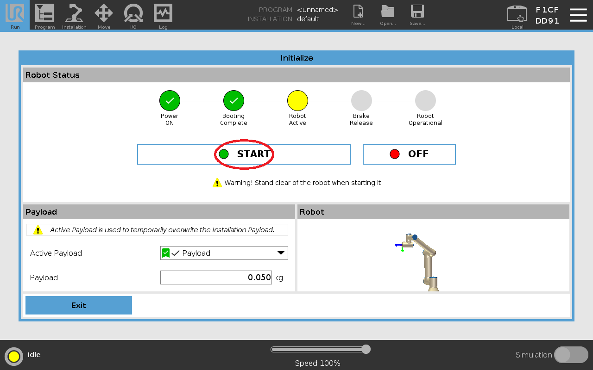
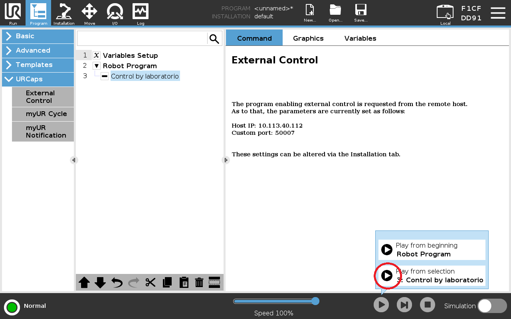
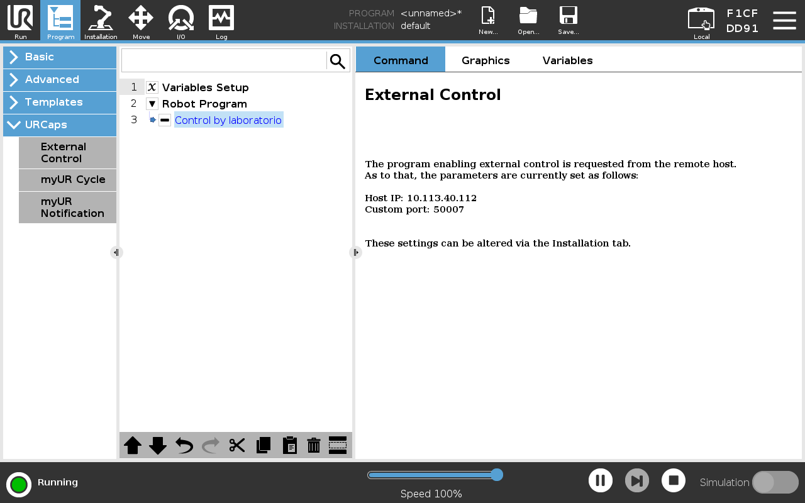

# ur_dual_calibration

## 🚀 Robot Initialization & External Control Guide (UR5)

Follow this step-by-step guide to power on the UR5 robotic arm, initialize it, and establish the external control communication loop with the master PC.

### 1. System Power-Up and Initialization
* **Step 01:** Power on the UR5 Control Box and wait for the PolyScope graphical interface to load. The main home screen will appear. Tap the robot status indicator (located at the bottom left corner) to access the hardware initialization screen.
  
  

* **Step 02:** Turn on the robot electronics by pressing **ON**.
  
  

* **Step 03:**  Once the joints are powered, tap **START** to release the mechanical brakes. You will hear a distinct clicking sound from the joints.
  
  

* **Step 04:** Verify that the robot status indicator turns solid green and displays **Normal**. This confirms the manipulator is fully active and ready for motion. Return to the main menu.
  
  


### 2. Loading the External Control Program
* **Step 05:** Select **Program Robot** to open the programming workflow interface.
  
  

* **Step 06:** Choose the option to load an existing program, in this case, select URCaps option.
  
  

* **Step 07:** Select the external control node parameters tab.
  
  

* **Step 08:** Double-check that the target PC IP address and port configuration match your local network setup. Leave the program execution screen open and ready on the Teach Pendant. **Do not press the Play button yet.**
  
  


### 3. Launching the PC Driver Node
Before triggering the program on the Teach Pendant, you must launch the hardware driver on your master PC.

Open a new terminal (**Terminal 1**) on your Linux workstation and run the following launch command:

```bash
ros2 launch ur_dual_control start_robot.launch.py
```
Once the terminal output confirms that the node is running and waiting for the hardware connection, proceed to the final steps on the Teach Pendant:

* **Step 09:** Press the **Play** (Execute) button at the bottom of the Teach Pendant screen to establish the remote connection loop.
  
  

* **Step 10:** The program status will switch to active (running loop). The driver terminal on your PC should now display a successful connection message. The UR5 is now fully listening to external motion commands and trajectories.
  
  


